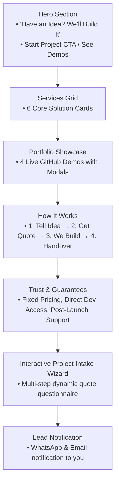

# 🚀 Productized AI Web & Automation Studio — Master Plan & Blueprint

---

## 📌 1. Executive Summary & Core Strategy

### The Pivot
* **Old Way (Low-Leverage Freelancing):** Competing on Upwork/Fiverr with thousands of bidders, bidding wars, race-to-the-bottom hourly rates, and high platform commissions.
* **New Model (Productized Service Studio):** An inbound lead-generation agency where clients visit the website, explore working demo applications, submit their project requirements through an interactive wizard, receive a transparent fixed-price quote, and pay a deposit before work begins.

### Value Proposition
> **"Have an idea? We'll build it."**  
> We transform business problems into high-performing websites, custom web applications, AI tools, and workflow automations — with fixed pricing and fast delivery.

### Competitive Advantages
1. **Developer + AI Superpower:** You use **Google AI Pro** to accelerate boilerplate code, write docs, analyze requirements, and draft proposals 5x faster while maintaining human engineering quality.
2. **Real Proof over Marketing Hype:** Rather than vague promises or fake client testimonials, you showcase real, working applications built from your GitHub portfolio.
3. **Zero Platform Fees & Direct Relationships:** Hosted on your own **Hostinger** plan, collecting leads via WhatsApp and Email directly.

---

## 🌟 2. Featured Portfolio Showcases (From Your GitHub)

Rather than generic templates, the site will spotlight 4 distinct production applications from your GitHub (`Asadullah404`), categorized into high-value agency offerings:

| Repo | Agency Service Category | Project Showcase Title | Key Client Features & Selling Points |
| :--- | :--- | :--- | :--- |
| **`auto-blog-ai`** | **AI Solutions & Workflow Automation** | **Autonomous AI Content Engine & WordPress Pipeline** | • Automated web scraping & content extraction<br>• Contextual SEO rewriting via LLMs<br>• Rank Math SEO optimization<br>• AI image generation<br>• Direct automated publishing via WordPress REST API |
| **`SMMC-PHARMACY-WEB`** | **Custom Web Apps & Enterprise Dashboards** | **Enterprise Inventory & Pharmacy Management Portal** | • Role-based access control & Firebase auth<br>• Real-time inventory tracking & low-stock alerts<br>• Interactive sales analytics & financial charts<br>• PDF invoice generation (`jspdf-autotable`)<br>• Excel reporting & data exports (`xlsx`) |
| **`Ai_Video_Dubbing`** | **Advanced AI & Multimedia Engineering** | **Multilingual AI Video Localization & Voice Studio** | • Full 9-stage video dubbing pipeline<br>• Speech-to-text with Faster-Whisper<br>• Neural zero-shot voice cloning (XTTS/Chatterbox)<br>• Lip-synchronization GANs (Wav2Lip)<br>• Web interface (Flask/FastAPI) & Cloud GPU worker |
| **`meal-mate`** | **SaaS Products & Consumer Web Apps** | **MealMate — Smart Lifestyle & Tracking Dashboard** | • Responsive modern UI/UX with smooth interactions<br>• Authentication & protected user routes<br>• Dynamic health & meal logging with visual charts<br>• History tracking and user profiles |

---

## 💰 3. Service Catalog & Transparent Starting Pricing

Clients want clarity. Transparent baseline pricing filters out low-quality inquiries and sets clear expectations:

| Service | What's Included | Starting Price Range |
| :--- | :--- | :--- |
| **High-Converting Business Website** | 3–6 pages, responsive design, SEO setup, lead forms, fast Hostinger deployment | **$175 – $350** |
| **Custom Web Application / Portal** | User authentication, database (Firebase/Supabase), custom CRUD workflows | **$500 – $1,200** |
| **AI Chatbot & Knowledge Assistant** | Custom system prompt, trained on company documents, website embed widget | **$250 – $550** |
| **Workflow & Business Automation** | Python/Node webhooks, CRM/Spreadsheet sync, automated email/WhatsApp alerts | **$200 – $600** |
| **Business Dashboard & Analytics** | Real-time charts, PDF invoice generator, Excel data import/export, inventory | **$400 – $900** |
| **API & Payment Gateway Integration** | Stripe, PayPal, WhatsApp Cloud API, custom REST APIs, Zapier webhooks | **$150 – $350** |

---

## 🖥️ 4. Landing Page Architecture & Flow



### Detailed Section Breakdown

#### 1. Header / Navbar
* **Logo:** Modern badge (e.g. *DevTown*).
* **Navigation Links:** Services, How It Works, Demos, Pricing, FAQ.
* **Header Action Button:** `[Start Your Project →]` with smooth scroll to the intake wizard.

#### 2. Hero Section
* **Badge:** `⚡ Fixed Pricing • Fast Turnaround • AI + Full-Stack Engineers`
* **Headline:**  
  *Have an Idea?*  
  *We’ll Build It Into Reality.*
* **Sub-headline:**  
  Custom business websites, web applications, AI chatbots, and workflow automations tailored to your exact business needs.
* **Dual Action Buttons:**  
  * Primary: `Start Your Project →` (Scrolls to intake form)  
  * Secondary: `Explore Live Demos` (Scrolls to portfolio)
* **Trust Badges:** Verified Tech Stacks (React, TypeScript, Python, Node, Supabase, Firebase, Tailwind).

#### 3. What We Build (Services Grid - 6 Cards)
1. **🌐 High-Performance Websites:** Fast, SEO-optimized business websites and landing pages built to convert visitors.
2. **💻 Custom Web Applications:** Secure client portals, booking systems, SaaS platforms, and internal tools.
3. **🤖 Custom AI Solutions:** AI chatbots, RAG knowledge assistants, and automated document analysis.
4. **⚙️ Workflow Automations:** Scrape data, sync CRMs, automate email/WhatsApp notifications, and remove repetitive tasks.
5. **📊 Business Dashboards:** Clean analytics panels, inventory trackers, and automated PDF/Excel invoice reporting.
6. **🔌 API Integrations:** Connect payments (Stripe/PayPal), AI endpoints, messaging tools, and backend databases.

#### 4. Live Portfolio Showcase (With Detailed Interactive Modals)
Each project card includes:
* High-contrast preview card with animated glow on hover.
* Category badge + Year.
* Modal view on click showing:
  * Full problem & solution breakdown.
  * Key feature bullet points.
  * Complete technology stack tags.
  * Direct links to live demo and GitHub source code.

#### 5. How It Works (Transparent 4-Step Process)
1. **01 / Tell Us What You Need:** Submit your project idea using our 2-minute project intake wizard. No tech jargon needed.
2. **02 / Get Your Scope & Fixed Quote:** We review your requirements and send a transparent scope, timeline, and fixed price quote.
3. **03 / We Build & Update:** Development starts upon milestone approval. You receive regular live progress previews.
4. **04 / Test, Deploy & Handover:** We deploy the project to your hosting (e.g. Hostinger), test all features, and deliver full ownership.

#### 6. Trust & Client Assurances
* **Fixed-Price Guarantee:** No surprise hourly invoices or scope creep.
* **Direct Developer Access:** Communicate directly with the engineer building your product, not an account manager.
* **100% Code Ownership:** You own all source code, design assets, and credentials upon project completion.
* **30-Day Post-Launch Support:** Free bug fixes and configuration support after launch.

#### 7. The Core Conversion Engine: Interactive Project Intake Wizard
Instead of a cold `contact@...` email link, visitors complete a guided, engaging questionnaire:

```
[ Step 1: Project Type ]
  ○ High-Performance Website
  ○ Custom Web App / SaaS
  ○ AI Chatbot / Automation Tool
  ○ Business Dashboard / Portal
  ○ Something Else / Not Sure

[ Step 2: Key Features Required ]
  ☑ User Authentication / Accounts
  ☑ Payment Processing / Checkout
  ☑ Database & Admin Dashboard
  ☑ AI Chat / LLM Integration
  ☑ Automated Email / WhatsApp Alerts
  ☑ PDF / Excel Report Generation

[ Step 3: Budget & Timeline ]
  • Budget Range: [ Under $300 | $300–$750 | $750–$1,500 | $1,500+ ]
  • Preferred Launch: [ ASAP (Within 7 days) | 2–3 Weeks | Flexible ]

[ Step 4: Contact & Submission ]
  • What should we build? (Brief description)
  • Name: [ __________________ ]
  • Email: [ __________________ ]
  • WhatsApp Number: [ __________________ ]

  [ 🚀 Submit Project & Get Free Quote → ]
```

---

## 🛠️ 5. Technical Implementation & Hostinger Deployment

### Tech Stack
* **Framework:** React 18 + Vite + TypeScript (for maximum speed and bulletproof type safety).
* **Styling:** Tailwind CSS + PostCSS + CSS custom properties.
* **Visual Polish:** Lucide React icons + Framer Motion animations.
* **Form & Validation:** React Hook Form + Zod (or lightweight state handling).
* **Color System:** High-contrast Dark Modern palette:
  * Background: `#090d16` (Deep Obsidian)
  * Surface/Cards: `#111827` (Rich Navy Slate with subtle borders `#1f293d`)
  * Primary Text: `#ffffff` (Pure crisp white)
  * Secondary Text: `#cbd5e1` (High-contrast slate, strictly avoiding dim grey)
  * Accents: `#06b6d4` (Electric Cyan) & `#10b981` (Emerald Green)
  * Light Mode Toggle: Included for users who prefer light backgrounds.

### Hostinger Deployment Strategy
1. Run `npm run build` locally in `D:\New portfolio`.
2. Produces an optimized, lightning-fast static output in `dist/`.
3. Upload `dist/` contents directly to Hostinger's `public_html` via FTP, Git deployment, or Hostinger File Manager.
4. Add a `.htaccess` file for clean React routing and SSL enforcement.

---

## 🤖 6. Google AI Pro Requirement Qualification Flow

When a client submits the intake form:
1. The submission payload is sent to your email / WhatsApp webhook.
2. A prompt template run via **Google AI Pro** automatically structures the messy client input into a clean proposal draft:
   * **Project Title & Scope Overview**
   * **Core Technical Milestones (Phase 1, Phase 2, Launch)**
   * **Estimated Timeline (e.g. 8–12 days)**
   * **Recommended Fixed Price (e.g. $450)**
   * **Draft Client Reply Message (ready to send via WhatsApp or Email)**
3. You review, adjust if needed, and send the professional proposal back within hours.

---

## 📅 7. Execution Checklist

- [x] Analyze developer background & GitHub projects (`auto-blog-ai`, `SMMC-PHARMACY-WEB`, `Ai_Video_Dubbing`, `meal-mate`).
- [x] Fix CLI theme contrast (`colorScheme: "dark"`).
- [x] Create comprehensive Master Plan markdown document.
- [ ] Initialize Vite + React + TypeScript + Tailwind project in `D:\New portfolio`.
- [ ] Implement High-Contrast Design System & Header Navigation.
- [ ] Build Hero Section with primary conversion triggers.
- [ ] Build 6-Service Capabilities Grid.
- [ ] Build Interactive Portfolio Showcase with modal drawers for the 4 GitHub projects.
- [ ] Build "How It Works" & "Trust Guarantees" sections.
- [ ] Build Interactive Multi-Step Project Intake Wizard with instant validation.
- [ ] Build Lead Dispatch (WhatsApp direct URL generator + Email mailto/webhook).
- [ ] Test build (`npm run build`) and prepare Hostinger deployment bundle.
